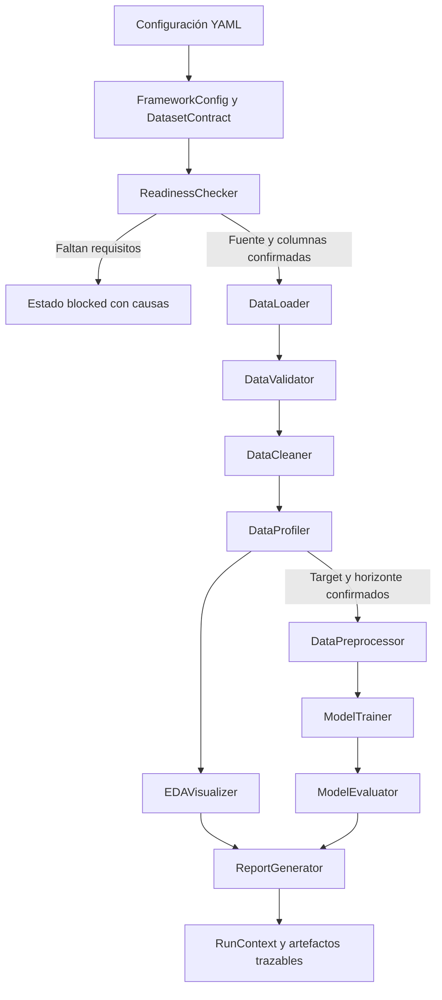

# Framework modular conceptual de Lumina

## Propósito

Este repositorio contiene la aproximación técnica preliminar del Avance de proyecto 2 de Programación para la inteligencia artificial. Organiza en módulos el flujo de carga, validación, limpieza, perfilado, visualización, preprocesamiento, entrenamiento, evaluación y reporte propuesto para Lumina Datos Operativos.

El caso de Red Comercial Boreal describe información general de ventas, inventarios, categorías, precios y promociones, pero no proporciona archivos, tablas, columnas, tipos, llaves ni variable objetivo. Por ello, este proyecto no incluye un dataset empresarial ni presenta estadísticas o métricas atribuidas a Lumina. Su primera salida válida es un diagnóstico de preparación que explica qué definiciones faltan.

## Estado y alcance

El framework está construido y probado como estructura preliminar configurable. Puede:

- diagnosticar si existen requisitos suficientes para perfilar o modelar;
- cargar archivos CSV sin cambiar sus encabezados;
- validar una tabla contra un contrato declarado;
- limpiar duplicados o renombrar columnas solo mediante una regla explícita;
- generar un perfil estructural sin exigir etiqueta;
- crear tres visualizaciones cuando las columnas necesarias están configuradas;
- separar entrenamiento y prueba respetando el tiempo;
- ajustar un estimador proporcionado externamente;
- evaluar regresión contra una línea base;
- producir perfiles y manifiestos trazables.

El proyecto no selecciona un algoritmo, no entrena un modelo de Boreal y no determina un horizonte de pronóstico. Esas decisiones requieren el contrato de datos y la validación operativa descritos en `docs/requisitos_de_datos.md`.

> **Alcance académico:** este repositorio demuestra la arquitectura y el comportamiento técnico del framework. No contiene una base de datos de Lumina, no define columnas reales y no presenta resultados de negocio.

## Organización

```text
lumina_avance_2/
├── config/
│   └── config.example.yaml
├── docs/
│   ├── arquitectura.md
│   ├── exploracion_generica.md
│   └── requisitos_de_datos.md
├── scripts/
│   └── generate_visuals.py
├── src/lumina_framework/
│   ├── core/
│   ├── data/
│   ├── preprocessing/
│   ├── visualization/
│   ├── modeling/
│   ├── reporting/
│   ├── pipeline/
│   └── cli.py
├── tests/
├── artifacts/
└── pyproject.toml
```

La agrupación es por capacidad. `cli.py` solo recibe argumentos e inicia el diagnóstico; no contiene reglas de datos, gráficas ni modelos.

## Arquitectura

Este diagrama está escrito con Mermaid dentro del README. GitHub interpreta el código y lo renderiza; no es una imagen insertada.



El detalle de clases, contratos, entradas y salidas se encuentra en [`docs/arquitectura.md`](docs/arquitectura.md), también escrito con Mermaid y tablas Markdown.

## Exploración genérica sin conocer el esquema

La primera exploración no intenta adivinar qué significa cada columna. Trabaja en dos niveles separados:

1. **Perfilado físico:** puede ejecutarse sobre cualquier `DataFrame` autorizado y describe filas, columnas, tipos inferidos, faltantes, duplicados, cardinalidad y estadísticos numéricos.
2. **Validación semántica:** comienza después, cuando exista un diccionario que confirme cuáles campos son identificadores, fechas, medidas, categorías y posible objetivo.

El recorrido técnico del perfilado es:

```text
Ruta CSV → DataLoader → pandas.DataFrame → DataProfiler
                                         ↓
                                   ProfileResult
                                         ↓
                              ReportGenerator → JSON
```

`pandas.DataFrame` es la representación principal porque conserva nombres de columnas y permite mezclar tipos. Los arreglos de NumPy son apropiados para cálculos numéricos vectorizados, pero no sustituyen al `DataFrame` durante el descubrimiento: convertir toda la tabla a un arreglo demasiado pronto eliminaría etiquetas y podría mezclar identificadores con medidas.

El perfilador puede utilizarse directamente sin definir una etiqueta:

```python
from pathlib import Path

from lumina_framework.data import DataLoader, DataProfiler

data = DataLoader().load(Path("ruta_a_fuente_autorizada.csv"))
profile = DataProfiler().profile(data)

print(profile.row_count, profile.column_count)
print(profile.dtypes)
print(profile.missing_counts)
print(profile.numeric_statistics)
```

El resultado permite conocer la estructura técnica, pero no autoriza conclusiones de negocio. Por ejemplo, una columna almacenada como número podría ser un identificador y no una variable cuantitativa. Esa interpretación requiere el contrato de datos.

La implementación actual carga el CSV en memoria porque todavía no se conoce el volumen. No se afirma soporte de big data. Si una prueba con la fuente real demuestra que no cabe en la memoria disponible o incumple el tiempo de ejecución acordado, el siguiente paso será incorporar lectura por bloques, selección de columnas o un adaptador para otro motor. No se añade esa complejidad antes de medirla.

La estrategia completa, las operaciones de Pandas y el papel de NumPy se documentan en [`docs/exploracion_generica.md`](docs/exploracion_generica.md).

## Visualizaciones exploratorias previstas

Todavía no se pueden construir gráficas de Lumina porque el caso no incluye observaciones ni nombres de columnas. Cuando exista un contrato de datos confirmado, el módulo `EDAVisualizer` podrá generar:

| Visualización | Campos requeridos | Pregunta que responde |
|---|---|---|
| Serie temporal | Fecha y variable numérica | ¿Cómo cambia la variable a lo largo del tiempo? |
| Mapa de calor agregado | Dos dimensiones categóricas y una medida | ¿Qué segmentos concentran los valores altos o bajos? |
| Distribución y atípicos | Variable numérica y grupo opcional | ¿Existen dispersión, asimetría o valores que requieran revisión? |

El archivo [`scripts/generate_visuals.py`](scripts/generate_visuals.py) conserva un experimento reproducible con Matplotlib. Los PNG resultantes no se versionan ni se incorporan al informe final; el documento académico describe la arquitectura y las propuestas mediante tablas. El script puede ejecutarse con:

```powershell
python scripts/generate_visuals.py
```

## Componentes

| Componente | Responsabilidad |
|---|---|
| `FrameworkConfig` | Mantener rutas independientes del esquema |
| `DatasetContract` | Representar definiciones confirmadas por el cliente |
| `ReadinessChecker` | Informar requisitos ausentes antes de ejecutar |
| `RunContext` | Registrar identidad, eventos y artefactos de una corrida |
| `DataLoader` | Leer CSV sin transformaciones silenciosas |
| `DataValidator` | Comparar datos contra el contrato |
| `DataCleaner` | Aplicar únicamente reglas autorizadas y registrarlas |
| `DataProfiler` | Describir estructura y calidad básica |
| `EDAVisualizer` | Generar figuras cuando existen los campos requeridos |
| `DataPreprocessor` | Separar periodos y construir transformadores no ajustados |
| `ModelTrainer` | Ajustar el estimador recibido solo con entrenamiento |
| `ModelEvaluator` | Comparar el candidato contra una línea base |
| `ReportGenerator` | Persistir perfil y manifiesto |
| `LuminaPipeline` | Coordinar las etapas sin absorber su lógica |

## Instalación en Windows

Desde esta carpeta:

```powershell
python -m venv .venv
.\.venv\Scripts\python.exe -m pip install -e ".[dev]"
```

## Diagnóstico conceptual

Ejecutar:

```powershell
.\.venv\Scripts\python.exe -m lumina_framework.cli --config config\config.example.yaml
```

La configuración de ejemplo conserva valores `null` y listas vacías de forma intencional. No son errores de programación ni espacios para completar al azar: representan definiciones que Boreal debe confirmar. La salida esperada informa:

```json
{
  "status": "blocked",
  "blocker_codes": [
    "missing_source",
    "missing_columns",
    "missing_target",
    "missing_prediction_horizon"
  ],
  "loaded_rows": null,
  "artifact_paths": []
}
```

## Pruebas

```powershell
.\.venv\Scripts\python.exe -m pytest -v
```

Los fixtures creados dentro de `tests` son tablas mínimas para comprobar contratos de software. No representan datos simulados de Lumina ni se utilizan para extraer conclusiones empresariales.

## Flujo previsto

```text
Configuración y contrato
          ↓
Diagnóstico de preparación
          ↓
Carga → Validación → Limpieza explícita → Perfilado
                                         ├→ Visualización
                                         └→ Preprocesamiento
                                               ↓
                                          Entrenamiento
                                               ↓
                                      Evaluación vs baseline
                                               ↓
                                            Reporte
```

Cada etapa comprueba sus condiciones de entrada. La falta de etiqueta bloquea el modelado, pero no impide un perfil estructural cuando sí existen fuente y columnas confirmadas.

## Librerías

- **Pandas:** lectura, validación y manipulación tabular.
- **NumPy:** validación numérica y cálculo de WAPE.
- **Matplotlib:** creación y exportación controlada de figuras.
- **Seaborn:** series, distribuciones y mapas de calor.
- **Scikit-learn:** transformadores, pipelines, modelos y métricas.
- **PyYAML:** configuración fuera del código.
- **Joblib:** persistencia futura del pipeline cuando exista un modelo válido.
- **Pytest:** pruebas automatizadas de comportamientos observables.

## Decisiones de calidad

- Una responsabilidad principal por módulo.
- Composición en lugar de una clase o archivo que haga todo.
- Configuración separada de la lógica.
- Objetos `dataclass` para contratos y resultados.
- Errores de dominio con mensajes accionables.
- Copias defensivas antes de limpiar o graficar.
- Registro de transformaciones y artefactos.
- Partición temporal cuando se declara una fecha.
- Ajuste del preprocesamiento solo con entrenamiento.
- Línea base obligatoria antes de recomendar un modelo.

## Uso de inteligencia artificial

Codex se utilizó como apoyo para organizar la arquitectura, redactar código, ejecutar pruebas y revisar la documentación. El estudiante debe leer, ejecutar, explicar y adaptar el contenido antes de entregarlo. La responsabilidad de validar las decisiones y declarar correctamente las limitaciones permanece en el estudiante.
