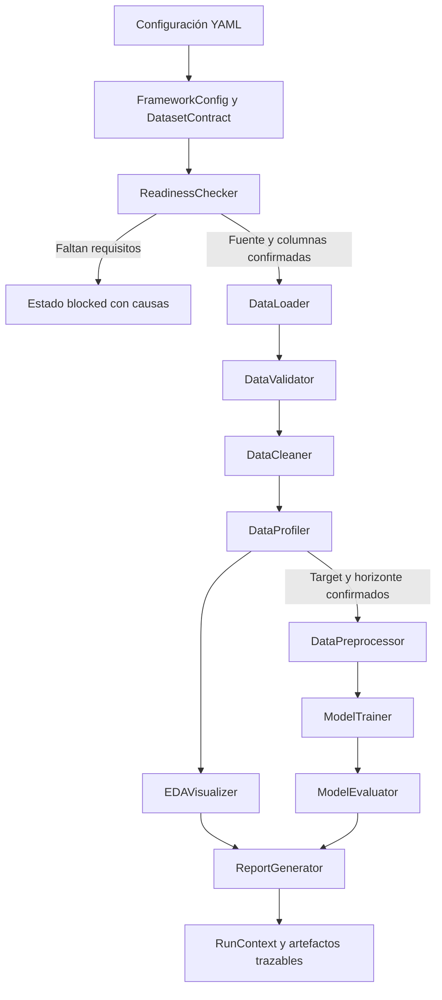
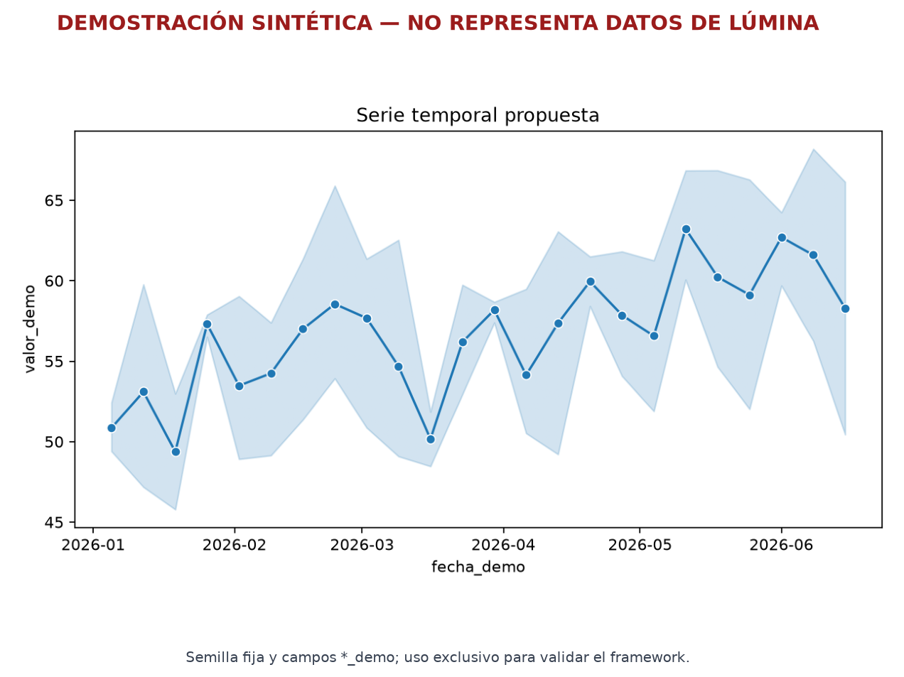
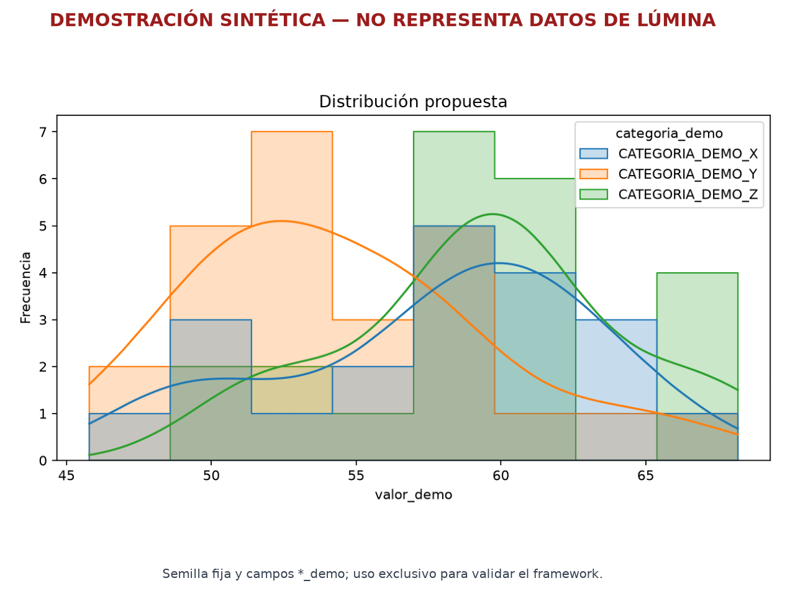
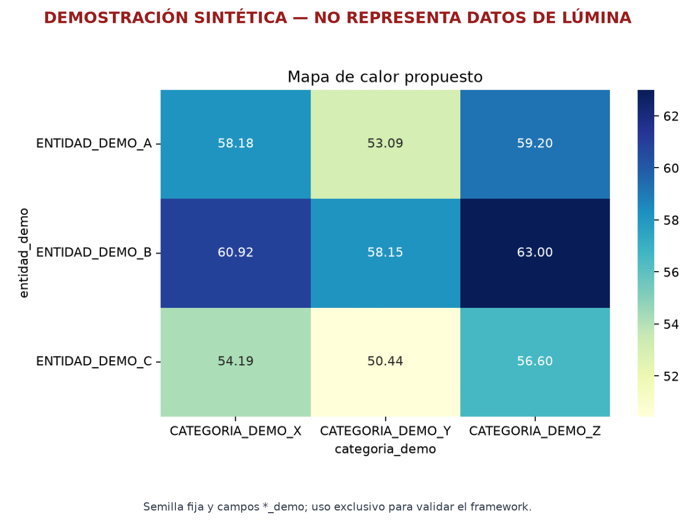

# Framework modular conceptual de Lumina

## Propósito

Este repositorio contiene la aproximación técnica preliminar del Avance de proyecto 2 de Programación para la inteligencia artificial. Organiza en módulos el flujo de carga, validación, limpieza, perfilado, visualización, preprocesamiento, entrenamiento, evaluación y reporte propuesto para Lumina Datos Operativos.

El caso de Red Comercial Boreal describe información general de ventas, inventarios, categorías, precios y promociones, pero no proporciona archivos, tablas, columnas, tipos, llaves ni variable objetivo. Por ello, este proyecto no incluye un dataset empresarial ni presenta estadísticas o métricas atribuidas a Lumina. Su primera salida válida es un diagnóstico de preparación que explica qué definiciones faltan.

Conforme a lo acordado con la profesora, GitHub funciona como medio de entrega del desarrollo técnico y como evidencia navegable y versionada. El documento académico explica las decisiones y la interpretación; este repositorio permite revisar la estructura, el código, la configuración, las pruebas y la documentación que respaldan esas explicaciones. Ambos forman una sola propuesta técnica.

## Estado y alcance

El framework está construido y probado como estructura preliminar configurable. Puede:

- diagnosticar si existen requisitos suficientes para perfilar o modelar;
- cargar archivos CSV sin cambiar sus encabezados;
- validar una tabla contra un contrato declarado;
- limpiar duplicados o renombrar columnas solo mediante una regla explícita;
- generar un perfil estructural sin exigir etiqueta;
- crear tres visualizaciones cuando las columnas necesarias están configuradas;
- separar entrenamiento y prueba respetando el tiempo;
- ajustar un estimador proporcionado externamente;
- evaluar regresión contra una línea base;
- producir perfiles y manifiestos trazables.

El proyecto no selecciona un algoritmo, no entrena un modelo de Boreal y no determina un horizonte de pronóstico. Esas decisiones requieren el contrato de datos y la validación operativa descritos en `docs/requisitos_de_datos.md`.

> **Alcance académico:** este repositorio demuestra la arquitectura y el comportamiento técnico del framework. No contiene una base de datos de Lumina, no define columnas reales y no presenta resultados de negocio.

## Relación con los once puntos de la actividad

| Punto | Respuesta del proyecto | Evidencia principal en GitHub |
|---|---|---|
| 1. Problemática y viabilidad | El análisis y el ML son viables de manera condicional; primero deben confirmarse datos, unidad de observación, objetivo y horizonte. | Este README y `docs/requisitos_de_datos.md` |
| 2. Objetivo técnico | Recibir, validar, limpiar, perfilar, visualizar, preparar, modelar, evaluar y reportar datos tabulares autorizados. | Secciones Estado y alcance y Componentes |
| 3. Arquitectura preliminar | Paquetes separados por responsabilidad y coordinación mediante compuertas. | `docs/arquitectura.md` y el diagrama Mermaid |
| 4. Entradas, procesos y salidas | Cada componente tiene un contrato y devuelve resultados tipados. | Tabla Componentes y documentación de clases |
| 5. Librerías | Pandas, NumPy, Matplotlib, Seaborn, scikit-learn, PyYAML, joblib y pytest. | Sección Librerías y `pyproject.toml` |
| 6. Flujo general | Configuración, diagnóstico, carga, validación, limpieza, perfilado, visualización o modelado y reporte. | Sección Flujo previsto |
| 7. Calidad | Reutilización, responsabilidades separadas, errores de dominio, trazabilidad, interpretabilidad y prevención de fuga. | Sección Decisiones de calidad y `tests/` |
| 8. Exploración | Perfilado físico genérico y una ejecución técnica reproducible con campos demostrativos. | `docs/exploracion_generica.md`, `docs/exploracion_sintetica.md` y el resumen generado |
| 9. Visualizaciones | Se describen las gráficas futuras y se comprueba su generación con una tabla sintética que no representa al negocio. | Secciones Visualizaciones exploratorias previstas y Validación técnica con datos sintéticos |
| 10. Trabajo propio | Decisiones técnicas, pruebas RED/GREEN, errores corregidos, bitácora y explicación personal. | `artifacts/development_log.md` y `docs/guia_defensa.md` |
| 11. Uso de IA | Codex se utilizó como apoyo técnico bajo revisión, adaptación y responsabilidad del estudiante. | Sección Uso de inteligencia artificial |

## Organización

```text
lumina_avance_2/
├── config/
│   └── config.example.yaml
├── docs/
│   ├── arquitectura.md
│   ├── evidencia_sintetica/
│   │   ├── resumen_demo.json
│   │   ├── resumen_demo.md
│   │   └── tres visualizaciones PNG reproducibles
│   ├── exploracion_generica.md
│   ├── exploracion_sintetica.md
│   ├── guia_defensa.md
│   └── requisitos_de_datos.md
├── scripts/
│   ├── generate_visuals.py
│   └── run_synthetic_eda_demo.py
├── src/lumina_framework/
│   ├── core/
│   ├── data/
│   ├── preprocessing/
│   ├── visualization/
│   ├── modeling/
│   ├── reporting/
│   ├── pipeline/
│   └── cli.py
├── tests/
├── artifacts/
│   └── development_log.md
└── pyproject.toml
```

La agrupación es por capacidad. `cli.py` solo recibe argumentos e inicia el diagnóstico; no contiene reglas de datos, gráficas ni modelos.

## Arquitectura

Este diagrama está escrito con Mermaid dentro del README. GitHub interpreta el código y lo renderiza; no es una imagen insertada.



El detalle de clases, contratos, entradas y salidas se encuentra en [`docs/arquitectura.md`](docs/arquitectura.md), también escrito con Mermaid y tablas Markdown.

## Exploración genérica sin conocer el esquema

La primera exploración no intenta adivinar qué significa cada columna. Trabaja en dos niveles separados:

1. **Perfilado físico:** puede ejecutarse sobre cualquier `DataFrame` autorizado y describe filas, columnas, tipos inferidos, faltantes, duplicados, cardinalidad y estadísticos numéricos.
2. **Validación semántica:** comienza después, cuando exista un diccionario que confirme cuáles campos son identificadores, fechas, medidas, categorías y posible objetivo.

El recorrido técnico del perfilado es:

```text
Ruta CSV → DataLoader → pandas.DataFrame → DataProfiler
                                         ↓
                                   ProfileResult
                                         ↓
                              ReportGenerator → JSON
```

`pandas.DataFrame` es la representación principal porque conserva nombres de columnas y permite mezclar tipos. Los arreglos de NumPy son apropiados para cálculos numéricos vectorizados, pero no sustituyen al `DataFrame` durante el descubrimiento: convertir toda la tabla a un arreglo demasiado pronto eliminaría etiquetas y podría mezclar identificadores con medidas.

El perfilador puede utilizarse directamente sin definir una etiqueta:

```python
from pathlib import Path

from lumina_framework.data import DataLoader, DataProfiler

data = DataLoader().load(Path("ruta_a_fuente_autorizada.csv"))
profile = DataProfiler().profile(data)

print(profile.row_count, profile.column_count)
print(profile.dtypes)
print(profile.missing_counts)
print(profile.numeric_statistics)
```

El resultado permite conocer la estructura técnica, pero no autoriza conclusiones de negocio. Por ejemplo, una columna almacenada como número podría ser un identificador y no una variable cuantitativa. Esa interpretación requiere el contrato de datos.

La implementación actual carga el CSV en memoria porque todavía no se conoce el volumen. No se afirma soporte de big data. Si una prueba con la fuente real demuestra que no cabe en la memoria disponible o incumple el tiempo de ejecución acordado, el siguiente paso será incorporar lectura por bloques, selección de columnas o un adaptador para otro motor. No se añade esa complejidad antes de medirla.

La estrategia completa, las operaciones de Pandas y el papel de NumPy se documentan en [`docs/exploracion_generica.md`](docs/exploracion_generica.md).

## Visualizaciones exploratorias previstas

Todavía no se pueden construir gráficas de Lumina porque el caso no incluye observaciones ni nombres de columnas. Cuando existan campos confirmados serán necesarias las siguientes visualizaciones. Las tres primeras corresponden a la exploración; la comparación real contra predicción se habilitará únicamente después de contar con un modelo válido:

| Visualización | Campos requeridos | Pregunta que responde |
|---|---|---|
| Serie temporal | Fecha y variable numérica | ¿Cómo cambia la variable a lo largo del tiempo? |
| Mapa de calor agregado | Dos dimensiones categóricas y una medida | ¿Qué segmentos concentran los valores altos o bajos? |
| Distribución y atípicos | Variable numérica y grupo opcional | ¿Existen dispersión, asimetría o valores que requieran revisión? |
| Real contra predicción | Fecha, valor real, candidato y baseline | ¿Dónde y cuándo mejora o falla el modelo frente a la referencia? |

El archivo [`scripts/generate_visuals.py`](scripts/generate_visuals.py) conserva el experimento reproducible usado para los bocetos conceptuales de arquitectura. Los PNG de ese script no se versionan ni se incorporan al informe final; el documento académico describe la arquitectura y las propuestas mediante tablas. El script puede ejecutarse con:

```powershell
python scripts/generate_visuals.py
```

## Validación técnica con datos sintéticos

Debido a que los materiales del caso no proporcionan un conjunto de datos real de
Lumina Datos Operativos, la exploración principal continúa considerándose un plan
técnico. No se presentan estadísticas ni patrones atribuidos a la organización. Para
comprobar de manera reproducible que las piezas implementadas pueden recibir un
`DataFrame`, calcular un perfil y producir las visualizaciones previstas, se construyó
adicionalmente una tabla sintética. Esta tabla no recrea la operación de Lumina ni
permite resolver anticipadamente un problema de negocio.

> **Advertencia:** dataset sintético utilizado exclusivamente para validar técnicamente el funcionamiento del framework. No representa datos de Lúmina Datos Operativos, Red Comercial Boreal ni resultados empresariales reales.

La ejecución es reproducible mediante una semilla fija y campos terminados en
`_demo`:

```powershell
python scripts/run_synthetic_eda_demo.py
```

El script genera la tabla en memoria y la entrega directamente a `DataProfiler` y
`EDAVisualizer`. No usa `DataLoader` porque crear y guardar un CSV temporal solo para
volver a abrirlo no aportaría una validación adicional; el cargador ya tiene pruebas
independientes con archivos temporales controlados.

La secuencia completa de exploración, con el código de Pandas, Matplotlib y Seaborn
visible junto a sus resultados, se encuentra en
[`docs/exploracion_sintetica.md`](docs/exploracion_sintetica.md). Las figuras mostradas
abajo son archivos producidos por ese código, no capturas manuales ni imágenes
generadas mediante inteligencia artificial.

### Estructura y resultados obtenidos

| Campo demostrativo | Tipo observado | Faltantes | Cardinalidad no nula |
|---|---:|---:|---:|
| `fecha_demo` | fecha | 0 (0.00%) | 24 |
| `entidad_demo` | texto | 0 (0.00%) | 3 |
| `categoria_demo` | texto | 3 (4.05%) | 3 |
| `valor_demo` | numérico | 4 (5.41%) | 66 |
| `promocion_demo` | booleano | 0 (0.00%) | 2 |

La ejecución produjo 74 filas, 5 columnas y detectó 2 duplicados exactos. Para
`valor_demo`, Pandas calculó 70 observaciones no nulas, media de `56.843857`,
desviación estándar de `5.462105`, mínimo de `45.78`, mediana de `57.51` y máximo
de `68.18`. Estos números validan operaciones del framework; no son indicadores del
caso empresarial. El detalle completo generado por el mismo script está en
[`docs/evidencia_sintetica/resumen_demo.md`](docs/evidencia_sintetica/resumen_demo.md)
y su versión estructurada en
[`resumen_demo.json`](docs/evidencia_sintetica/resumen_demo.json).

### Visualizaciones generadas







| Evidencia técnica | Pregunta que prueba en la demostración | Pregunta futura con datos reales |
|---|---|---|
| Serie temporal | ¿El visualizador procesa una fecha, una medida y faltantes sin modificar la entrada? | ¿Cómo cambia la variable de negocio confirmada a lo largo del tiempo? |
| Distribución | ¿Puede describir dispersión y comparar categorías declaradas? | ¿Existen asimetrías o valores que deban revisarse por segmento? |
| Mapa de calor | ¿Puede agregar una medida entre dos dimensiones? | ¿Qué combinaciones reales concentran valores altos o bajos? |

### Relación entre el script y el framework

| Paso | Implementación reutilizada | Salida |
|---|---|---|
| Generación controlada | NumPy y Pandas dentro del script | `DataFrame` reproducible con anomalías conocidas |
| Perfilado | `DataProfiler.profile()` | Estructura, faltantes, duplicados, cardinalidad y estadísticos |
| Visualización | Tres métodos de `EDAVisualizer` | PNG rotulados explícitamente como sintéticos |
| Evidencia | Serialización del mismo resumen calculado | JSON y Markdown verificables |

| Capacidad | Datos sintéticos | Datos reales de Lumina |
|---|---:|---:|
| Comprobar ejecución del código | Sí | Sí |
| Comprobar estadísticas descriptivas | Sí | Sí |
| Comprobar generación de visualizaciones | Sí | Sí |
| Validar el esquema real del negocio | No | Sí |
| Identificar patrones empresariales reales | No | Sí |
| Entrenar un modelo válido para Boreal | No | Sí |
| Apoyar decisiones empresariales | No | Sí |

La columna de datos reales indica qué podrá validarse cuando la fuente sea recibida y
autorizada; no significa que esas tareas ya se hayan ejecutado.

La demostración aumenta la evidencia ejecutable del avance, pero no elimina las
compuertas existentes: el flujo empresarial continúa en estado `blocked` mientras no
se reciban fuente, esquema, variable objetivo y horizonte confirmados.

## Componentes

| Componente | Responsabilidad |
|---|---|
| `FrameworkConfig` | Mantener rutas independientes del esquema |
| `DatasetContract` | Representar definiciones confirmadas por el cliente |
| `ReadinessChecker` | Informar requisitos ausentes antes de ejecutar |
| `RunContext` | Registrar identidad, eventos y artefactos de una corrida |
| `DataLoader` | Leer CSV sin transformaciones silenciosas |
| `DataValidator` | Comparar datos contra el contrato |
| `DataCleaner` | Aplicar únicamente reglas autorizadas y registrarlas |
| `DataProfiler` | Describir estructura y calidad básica |
| `EDAVisualizer` | Generar figuras cuando existen los campos requeridos |
| `DataPreprocessor` | Separar periodos y construir transformadores no ajustados |
| `ModelTrainer` | Ajustar el estimador recibido solo con entrenamiento |
| `ModelEvaluator` | Comparar el candidato contra una línea base |
| `ReportGenerator` | Persistir perfil y manifiesto |
| `LuminaPipeline` | Coordinar las etapas sin absorber su lógica |

## Instalación en Windows

Desde esta carpeta:

```powershell
python -m venv .venv
.\.venv\Scripts\python.exe -m pip install -e ".[dev]"
```

## Diagnóstico conceptual

Ejecutar:

```powershell
.\.venv\Scripts\python.exe -m lumina_framework.cli --config config\config.example.yaml
```

La configuración de ejemplo conserva valores `null` y listas vacías de forma intencional. No son errores de programación ni espacios para completar al azar: representan definiciones que Boreal debe confirmar. La salida esperada informa:

```json
{
  "status": "blocked",
  "blocker_codes": [
    "missing_source",
    "missing_columns",
    "missing_target",
    "missing_prediction_horizon"
  ],
  "loaded_rows": null,
  "artifact_paths": []
}
```

## Pruebas

```powershell
.\.venv\Scripts\python.exe -m pytest -v
```

Los fixtures creados dentro de `tests` son tablas mínimas para comprobar contratos de software. No representan datos simulados de Lumina ni se utilizan para extraer conclusiones empresariales.

## Flujo previsto

```text
Configuración y contrato
          ↓
Diagnóstico de preparación
          ↓
Carga → Validación → Limpieza explícita → Perfilado
                                         ├→ Visualización
                                         └→ Preprocesamiento
                                               ↓
                                          Entrenamiento
                                               ↓
                                      Evaluación vs baseline
                                               ↓
                                            Reporte
```

Cada etapa comprueba sus condiciones de entrada. La falta de etiqueta bloquea el modelado, pero no impide un perfil estructural cuando sí existen fuente y columnas confirmadas.

## Librerías

- **Pandas:** lectura, validación y manipulación tabular.
- **NumPy:** validación numérica y cálculo de WAPE.
- **Matplotlib:** creación y exportación controlada de figuras.
- **Seaborn:** series, distribuciones y mapas de calor.
- **Scikit-learn:** transformadores, pipelines, modelos y métricas.
- **PyYAML:** configuración fuera del código.
- **Joblib:** persistencia futura del pipeline cuando exista un modelo válido.
- **Pytest:** pruebas automatizadas de comportamientos observables.

## Decisiones de calidad

- Una responsabilidad principal por módulo.
- Composición en lugar de una clase o archivo que haga todo.
- Configuración separada de la lógica.
- Objetos `dataclass` para contratos y resultados.
- Errores de dominio con mensajes accionables.
- Copias defensivas antes de limpiar o graficar.
- Registro de transformaciones y artefactos.
- Partición temporal cuando se declara una fecha.
- Ajuste del preprocesamiento solo con entrenamiento.
- Línea base obligatoria antes de recomendar un modelo.

## Uso de inteligencia artificial

### Cómo utilicé la inteligencia artificial

Utilicé Codex como una herramienta de apoyo técnico para explorar alternativas, revisar conceptos, acelerar parte de la implementación, generar pruebas y comprobar que el framework se comportara de acuerdo con lo que yo había definido previamente.

Antes de comenzar a programar ya tenía claro cómo quería organizar la solución y qué problemas quería evitar. La arquitectura no surgió simplemente de pedirle a una herramienta de inteligencia artificial que diseñara un framework. Desde el inicio quería separar responsabilidades, evitar concentrar toda la lógica en un solo archivo y trabajar con clases, métodos, contratos y componentes que pudieran mantenerse de manera independiente.

Codex me ayudó a explorar con mayor profundidad algunas alternativas técnicas y a convertir esas decisiones en una implementación más completa. Yo fui indicando cómo debía funcionar cada parte, qué responsabilidad tendría cada componente, qué comportamientos no quería permitir y qué condiciones debían cumplirse antes de avanzar a otra etapa.

Un criterio definido desde el diseño fue que el sistema no debía inventar columnas, nombres de variables, datos, target ni resultados para aparentar que el proyecto estaba completo. Si faltaba información, el propio framework debía reconocerlo y detenerse de forma controlada. De esa decisión surgieron las compuertas de preparación y los estados de bloqueo.

### De dónde surgió la organización del framework

La forma de organizar este proyecto se relaciona con experiencias anteriores al curso. En un backend de ERP llegué a concentrar demasiada lógica en pocos archivos, principalmente en `app.py`. Conforme agregaba funciones resultaba más difícil localizar responsabilidades y modificar una parte sin revisar muchas otras. Esa experiencia me hizo decidir que en este framework cada capacidad debía tener una ubicación y una responsabilidad claras.

La idea adquirió todavía más sentido al encontrar en mi trabajo actual una problemática relacionada con extracción, preparación y limpieza de información. Existen scripts separados y pocas personas encargadas del proceso, por lo que localizar tareas, modificar código o reutilizar soluciones puede consumir mucho tiempo. Así, clases, métodos, tipos de datos, modularidad y manejo de excepciones dejaron de ser solo conceptos académicos y se relacionaron con una necesidad profesional concreta.

### Mi participación en las decisiones técnicas

Decidí separar carga, validación, limpieza, perfilado, visualización, preprocesamiento, modelado y reportes para que cada componente tuviera una responsabilidad clara. También elegí composición en lugar de una jerarquía extensa de herencia, porque considero más importante sustituir componentes independientemente que obligarlos a pertenecer a una estructura rígida.

Preferí mantener nombres de columnas, target y horizonte como valores pendientes antes que inventarlos. También establecí que, si el problema termina siendo una predicción temporal, la división entre entrenamiento y evaluación debe respetar el orden del tiempo en lugar de aplicar automáticamente una división aleatoria.

### Proceso de trabajo y validación

El trabajo con Codex fue iterativo: yo definía el comportamiento esperado, revisaba la propuesta o implementación y solicitaba ajustes cuando algo no correspondía con la estructura deseada. Un ejemplo fue el horizonte de predicción. Detecté que aparecía en el diseño, pero no estaba representado consistentemente en el contrato y la configuración. Se añadió una prueba que inicialmente falló y después se corrigieron el contrato, el YAML y el verificador hasta obtener el comportamiento esperado.

La versión actual cuenta con 27 pruebas aprobadas: las 24 pruebas previas del framework más 3 comprobaciones de la demostración sintética y su trazabilidad en GitHub. También se realizaron comprobaciones de importación y compilación. La configuración vacía devuelve correctamente un estado `blocked`, lo que demuestra que el framework no intenta continuar cuando faltan una fuente, columnas, target u horizonte.

### Responsabilidad sobre el resultado

La responsabilidad final sobre la arquitectura y las decisiones permanece en mí. Para mí no es suficiente que el código funcione: debo poder explicar por qué existe una clase, qué responsabilidad tiene, por qué un método pertenece a un componente, qué información recibe, qué devuelve y cómo se relaciona con el resto del framework. La inteligencia artificial amplió lo que pude explorar y construir, pero no sustituyó la decisión sobre qué quería hacer ni la revisión del resultado.
