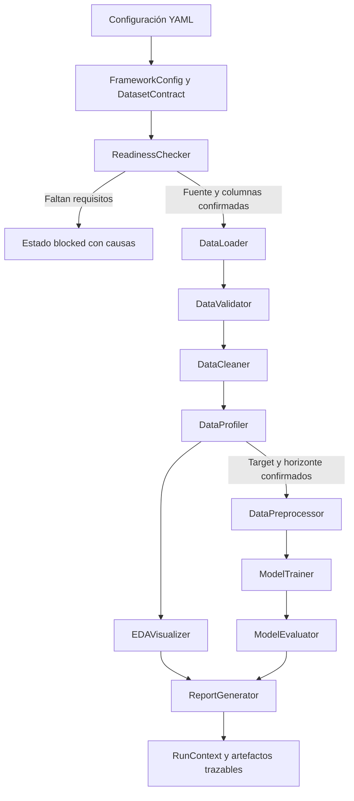
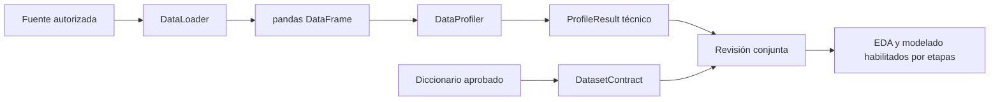
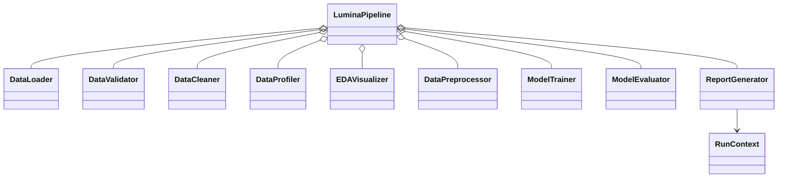

# Arquitectura del framework modular de Lumina

## Decisión principal

La solución se organiza por capacidades y no alrededor de un único `app.py`. Cada paquete representa una responsabilidad y expone contratos pequeños. `LuminaPipeline` utiliza composición para coordinar objetos; no repite la lógica de los módulos.

## Diagrama de componentes reproducible en GitHub

Las flechas representan el flujo previsto. La rama `blocked` es la salida correcta mientras no existan datos, columnas, target y horizonte confirmados.

## Perfilado físico antes del contrato semántico

`DataProfiler` no necesita conocer una etiqueta ni nombres de negocio para describir un `DataFrame` que ya fue autorizado. Su método `profile()` produce forma, tipos físicos, faltantes, duplicados, cardinalidad y estadísticos para las columnas numéricas disponibles.

Este perfilado no equivale a validar el significado de los campos. El flujo completo de `LuminaPipeline.run_profile()` conserva una compuerta más estricta porque valida la fuente contra `DatasetContract`. Mientras no exista ese contrato, el componente puede probarse de forma aislada para reconocimiento técnico, pero el pipeline no presenta el resultado como análisis empresarial.

La separación evita dos errores: interpretar automáticamente un identificador numérico como medida y usar una fecha o variable objetivo que todavía no fue confirmada.

## Relaciones de clases

La relación `o--` representa composición, no herencia. Los modelos supervisados pueden intercambiar estimadores compatibles con Scikit-learn sin cambiar la evaluación.

## Contratos de clases

| Clase | Atributos principales | Método | Resultado |
|---|---|---|---|
| `FrameworkConfig` | `source_path`, `output_dir` | No aplica | Configuración inmutable |
| `DatasetContract` | columnas, llave, fecha, objetivo, predictores | No aplica | Contrato inmutable |
| `ReadinessChecker` | Sin estado | `check()` | `ReadinessResult` |
| `RunContext` | ID, inicio, estado, eventos, artefactos | `start()`, `record_event()`, `record_artifact()` | Manifiesto serializable |
| `DataLoader` | Sin estado | `load()` | `DataFrame` original |
| `DataValidator` | Sin estado | `validate()` | `ValidationResult` |
| `DataCleaner` | Sin estado | `clean()` | `CleaningResult` |
| `DataProfiler` | Sin estado | `profile()` | `ProfileResult` |
| `EDAVisualizer` | Directorio de salida | tres métodos `plot_*()` | Archivos PNG |
| `DataPreprocessor` | Fracción de prueba | `prepare()` | `PreprocessingResult` |
| `ModelTrainer` | Sin estado | `train()` | `TrainingResult` |
| `ModelEvaluator` | Sin estado | `evaluate_regression()` | `EvaluationResult` |
| `ReportGenerator` | Sin estado | `generate_profile_reports()` | Rutas JSON |
| `LuminaPipeline` | Objetos de las etapas | `assess()`, `run_profile()` | `RunResult` |

## Entradas procesos y salidas

| Módulo | Entrada | Proceso | Salida |
|---|---|---|---|
| Carga | Ruta CSV | Verificar y leer | Tabla sin modificaciones |
| Validación | Tabla y contrato | Comparar estructura, llave y fecha | Hallazgos de validación |
| Limpieza | Tabla y reglas autorizadas | Copiar y transformar con bitácora | Tabla limpia y cambios |
| Perfilado | Tabla | Calcular forma, tipos, faltantes, duplicados y estadísticos | Perfil estructural |
| Visualización | Tabla y roles de columnas | Validar y representar | Figura PNG |
| Preprocesamiento | Tabla y contrato supervisado | Separar periodos y construir transformador | Datos para entrenamiento y prueba |
| Entrenamiento | Partición y estimador | Ajustar pipeline solo con entrenamiento | Pipeline y predicciones |
| Evaluación | Reales, candidato y baseline | Calcular MAE, RMSE y WAPE | Comparación explícita |
| Reporte | Resultados y contexto | Serializar perfil y manifiesto | JSON auditables |

## Flujo de errores

1. `ReadinessChecker` detecta ausencias antes de acceder a datos.
2. `DataLoader` lanza `DataSourceError` ante fuente inexistente o formato no admitido.
3. `DataValidator` devuelve todos los hallazgos observables de una sola vez.
4. `DataCleaner` lanza `SchemaConfigurationError` si una regla menciona columnas ausentes.
5. `DataPreprocessor` lanza `TargetNotConfiguredError` si no existe una etiqueta validada.
6. `ModelEvaluator` lanza `InsufficientDataError` ante arreglos vacíos, desalineados o no finitos.
7. `LuminaPipeline` no captura un error crítico para continuar silenciosamente.

## Evolución posterior

La siguiente etapa se activa cuando Boreal entregue una fuente y un diccionario aprobados. Entonces se agrega una configuración real, se ejecuta el perfilado y se acuerdan correcciones. El modelado solo inicia después de cerrar la unidad de observación, la etiqueta, la fecha de corte, el horizonte y la métrica de negocio.
